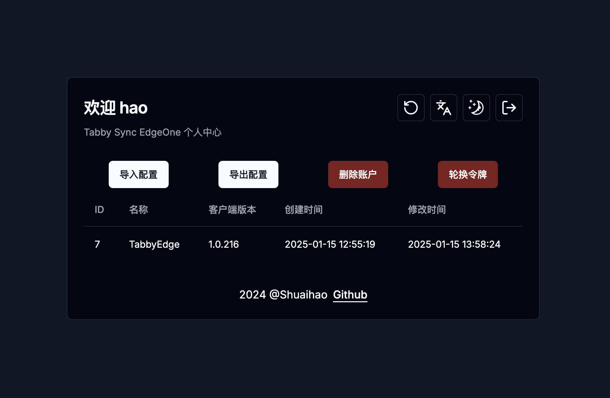
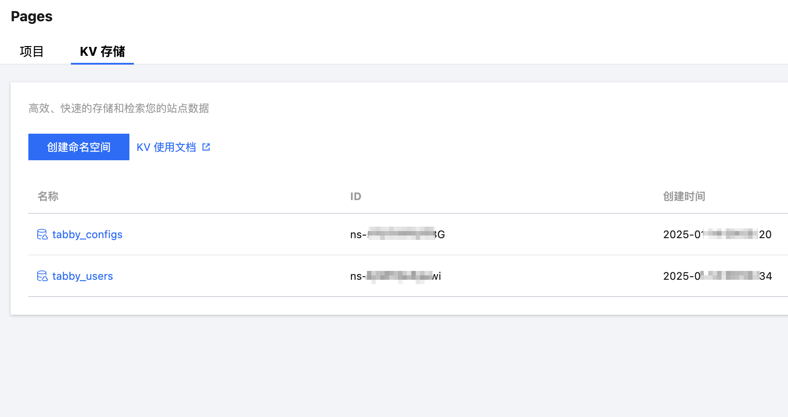
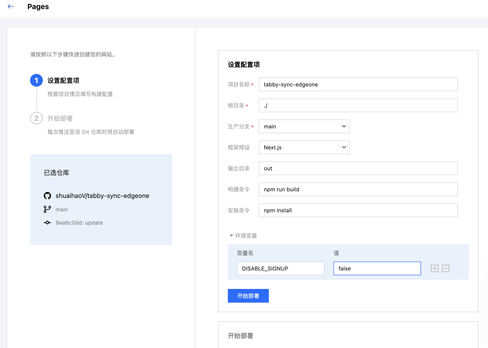
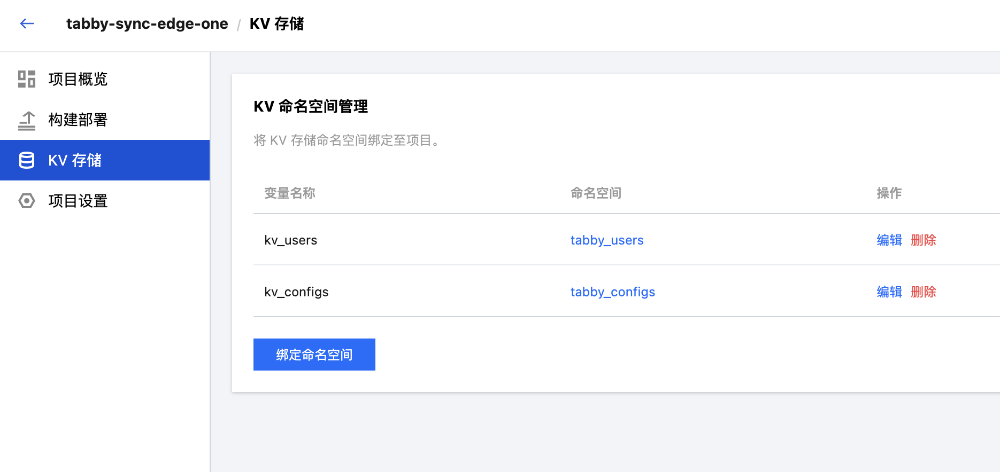
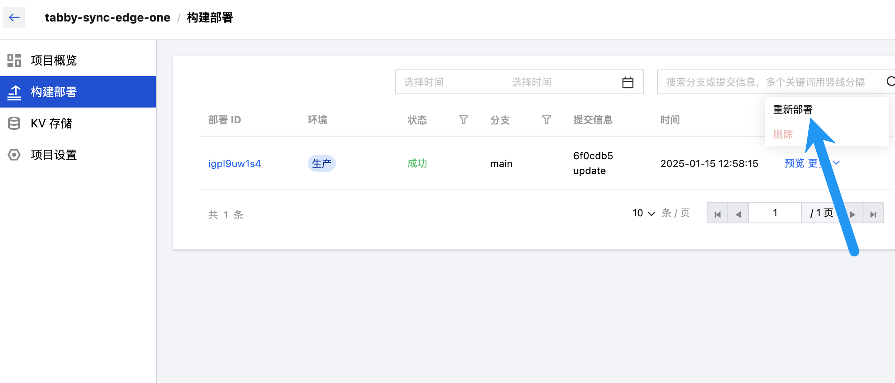
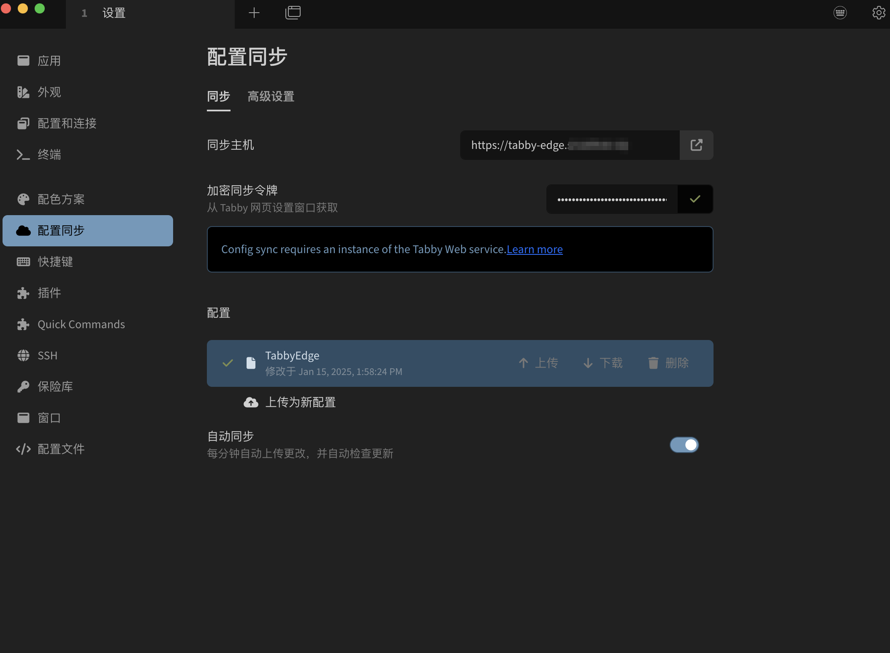

# tabby-sync-edgeone

`tabby-sync-edgeone` 是一个使用 腾讯云EdgeOne 编写的非官方同步 API服务，为 Tabby 终端工具提供同步功能,方便用户进行交互和管理。



## 特性

- **超低延迟**：利用腾讯云EdgeOne Pages部署,客户端请求将自动被调度至靠近用户最近的边缘节点上，命中触发规则触发边缘函数对请求进行处理并响应结果给客户端，可显著降低客户端的访问时延。
- **易于使用**：根据Tabby终端同步接口实现，无需安装任何插件，方便集成到现有的 Tabby 终端工具中。
- **现代前端**：使用 Next.js 构建的前端页面，提供直观的用户界面和良好的用户体验。
- **安全**：使用AES-GCM加密算法对同步数据进行加密存储，密钥为令牌明文，数据库仅存储Sha512哈希值。
- **Serverless 架构**: 无需再关心和维护底层服务器的内存、CPU、网络和其他基础设施资源，可以挪出精力更专注业务代码的开发。
---

## 开始使用

> 建议本地Tabby客户端开启`保险库-加密配置文件`,确保在任何情况下均无法获取配置明文

- 登陆 [腾讯云EdgeOne Pages控制台](https://console.cloud.tencent.com/edgeone/pages)

- 申请开通KV存储

- 创建两个命名空间,一个命名空间用于存储用户信息,一个命名空间用于存储用户配置
 

- 创建Pages项目,并填写环境变量 `DISABLE_SIGNUP`
  > `DISABLE_SIGNUP` 为字符串`true`,则禁用注册功能,否则启用注册功能

  > 首次使用时,请设置为`false`,部署完成并在web中注册成功后,再改为`true`,并重新部署项目

  

- 部署成功后,邦定KV存储命名空间
  > 变量名`kv_users`绑定的为用户信息命名空间

  > 变量名`kv_configs`绑定的为用户配置命名空间

    

- 重新部署,应用配置
 

- 访问Web并注册,获取令牌
  > 令牌为用户唯一标识,用于加密解密配置文件,请妥善保存

- 客户端配置

  > 同步主机填写URL即可,填入加密令牌后即可回车

  

---

## 禁用注册

- pages后端在部署后会检查环境变量`DISABLE_SIGNUP`,若为字符串`true`,则禁用

- 修改环境变量`DISABLE_SIGNUP`后,请在`构建部署`中点击`重新部署`

---

## 开发

> 请参照 [Tabby 客户端代码](https://github.com/Eugeny/tabby/blob/master/tabby-settings/src/services/configSync.service.ts) 进行接口实现

1. 克隆仓库：
    ```bash
    git clone https://github.com/shuaihaoV/tabby-sync-edgeone.git
    cd tabby-sync-edgeone
    ```
2. 安装依赖：
    ```bash
    npm install
    ```

3. 运行开发服务器：
    ```bash
    npm run dev
    ```

4. 启动edgeone 本地开发环境
    > EdgeOne Pages 本地调试将调用云端资源,每日限制调试启动次数,建议启动后不要关闭
    ```bash
    # 绑定项目
    edgeone pages link 
    # 启动本地开发环境
    edgeone pages dev
    ```

5. 修改`next.config.mjs`
    > 本地调试时,注释`output`和`outDir`, 取消注释`rewrites`
    > 提交部署时,注释`rewrites`, 取消注释`output`和`outDir`

### 加密

- 加密实现代码为 [utils.js](./functions/utils.js)

  ```javascript
    export async function encrypt(key, plaintext) {
        const iv = crypto.getRandomValues(new Uint8Array(12));
        const encoder = new TextEncoder();
        const data = encoder.encode(plaintext);
        const encryptedData = await crypto.subtle.encrypt(
            {
                name: 'AES-GCM',
                iv: iv,
            },
            key,
            data
        );
        const encryptedDataHex = Array.from(new Uint8Array(encryptedData))
            .map(b => b.toString(16).padStart(2, '0'))
            .join('');
        const ivHex = Array.from(new Uint8Array(iv))
            .map(b => b.toString(16).padStart(2, '0'))
            .join('');
        return `${ivHex}.${encryptedDataHex}`;
    }
  ```

- 加密密钥(即用户令牌)  为 `Aes256Gcm`的生成密钥,数据库存储Sha512哈希值
- `获取配置`请求时,使用用户传入的令牌明文作为密钥,解密数据库中密文并返回
- `上传配置`请求时,使用用户传入的令牌明文作为密钥,加密用户传入的明文配置,存储在数据库中

---

## 贡献

欢迎贡献代码！请提交 Pull Request 或报告问题。

---

## 相关项目

- [tabby](https://github.com/Eugeny/tabby) : Tabby (前身是 Terminus) 是一个可高度配置的终端模拟器和 SSH 或串口客户端，支持 Windows，macOS 和 Linux

---

## 许可证

本项目采用 MIT 许可证。详情请参阅 [LICENSE](./LICENSE) 文件。
